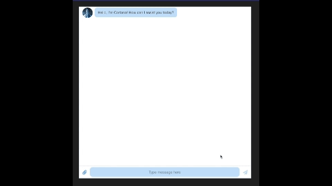

<h1 align="center">Cortana Bot</h1>

Take a look at it here 👉 

This is using OpenAI's free chatGPT 3.5 turbo API. It does have limitations and will expire by 10/14/23.

<h2 align="center">Tech Used</h2> 

 React, Javascript

<h2 align="center">Goals and Accomplishments</h2>
Fun project creating a chatbot using GPT 3.5 turbo with the system that will explain things as Cortana, Master Chief's AI assistant from Halo.

<h2 align="center">Optimizations</h2>

Optimized this to fit all screen sizes as best as possible. The goal was for the user to have a fluid experience on all their devices. Designed with mobile-first in mind.

# Install

`npm install`

---

# Things to add

- Create a `.env` file and add the following as `key = value`

- API_KEY = `your openAI API key`

---

# Run

`npm start`

# Have fun testing and improving it! 😎

# Cortana Bot
